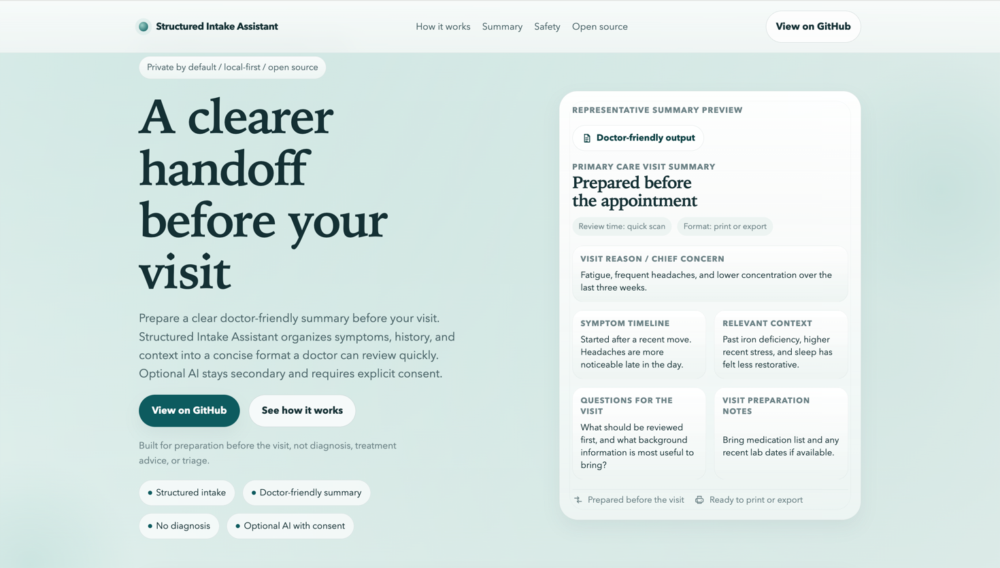

# Structured Intake Assistant Landing

A standalone landing page for **Structured Intake Assistant** — a privacy-first concept that helps patients prepare a clear, structured, doctor-friendly summary before a primary care visit.

**Live demo:** [kononyukii.github.io/structured-intake-assistant-landing](https://kononyukii.github.io/structured-intake-assistant-landing/)  
**Main product repo:** [Structured Intake Assistant](https://github.com/kononyukii/structured-intake-assistant)



## Why this exists

Doctor visits are often short, stressful, and hard to navigate clearly.

People forget important details, describe symptoms in fragments, or leave feeling like key context never made it into the conversation.

Structured Intake Assistant is designed as a **clearer handoff between patient and doctor** — helping patients prepare what matters before the visit, in a format that is easier to review.

## What the product is

Structured Intake Assistant is a concept for:

- structured intake before a primary care visit
- a clear, doctor-friendly summary
- privacy-first, local-first interaction
- optional AI only with explicit consent
- open-source product development

## What it is not

This is **not**:

- an AI doctor
- a diagnosis tool
- a symptom checker
- a treatment advisor
- a triage or urgency system

## About this repository

This repository contains the **standalone marketing landing page**.

It focuses on:

- explaining the product clearly
- communicating trust and safety boundaries
- presenting the value of a doctor-friendly summary
- providing a lightweight, shareable product-facing experience while the main app is still in development

Because the main application is still being built, the landing emphasizes **representative output and product framing**, rather than pretending to show a fully shipped application UI.

## Tech

- HTML
- CSS
- JavaScript

## Run locally

No build step is required.

Run a static server from the repository root:

```bash
python3 -m http.server 4173
```

Then open:

```text
http://localhost:4173
```

## Status

This is the current **v1 landing experience** for the project.

The main focus right now is to communicate:

- the product idea
- the trust model
- the privacy and safety boundaries
- the visual direction for the future product experience

## Related project

If you want the actual application repository, go here:

[Structured Intake Assistant](https://github.com/kononyukii/structured-intake-assistant)
